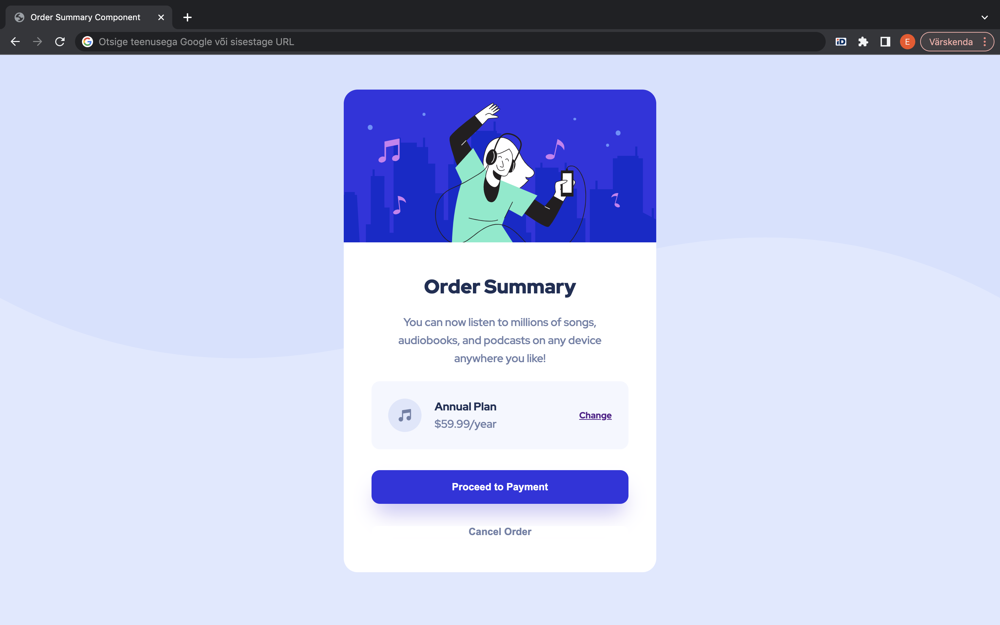

# Frontend Mentor - Order summary card solution

This is a solution to the [Order summary card challenge on Frontend Mentor](https://www.frontendmentor.io/challenges/order-summary-component-QlPmajDUj). Frontend Mentor challenges help you improve your coding skills by building realistic projects. 

## Table of contents

- [Overview](#overview)
  - [The challenge](#the-challenge)
  - [Screenshot](#screenshot)
  - [Links](#links)
- [My process](#my-process)
  - [Built with](#built-with)
  - [What I learned](#what-i-learned)
  - [Useful resources](#useful-resources)
- [Author](#author)
- [Acknowledgments](#acknowledgments)

**Note: Delete this note and update the table of contents based on what sections you keep.**

## Overview

### The challenge

Users should be able to:

- See hover states for interactive elements

### Screenshot

### Links

- Solution URL: [Add solution URL here](https://your-solution-url.com)
- Live Site URL: [Add live site URL here](https://your-live-site-url.com)

## My process

### Built with

- Semantic HTML5 markup
- CSS custom properties

### What I learned

I am a total beginner in frontend, so I created it from a scratch with a help of freeCodeCamp's YouTube video "HTML / CSS Tutorial – Create an Order Summary Component" (https://youtu.be/SR5GxoFhIAU).
At first, I wrote the code just as it was taught and then I tried to write a code by myself two times. I also learned about the box-shadow code of CSS from a YouTube video "CSS box-shadows - how to make them look good" (https://youtu.be/Yon4l3MUBGY) and applied it.

There is not much to be proud of, since this was a first time for me. However, I did realize that uppercases and lowercases were not paid enough attention in the tutorial video, so I could fix it by myself. Probably I can be pround of that.

### Useful resources

- [CSS box-shadows - how to make them look good](https://youtu.be/Yon4l3MUBGY) - It helped me understand how to make box-shadow in CSS, and his YouTube channel seems to have different useful resources for learning CSS.

## Author

- Website - [Ejc2us10](https://github.com/Ejc2us10) (not active yet)
- Frontend Mentor - [@Ejc2us10](https://www.frontendmentor.io/profile/Ejc2us10)

## Acknowledgments

Madison Kanna for freeCodeCamp: thank you for your wonderful instruction video!

Kevin Powell: thank you for your YouTube video!